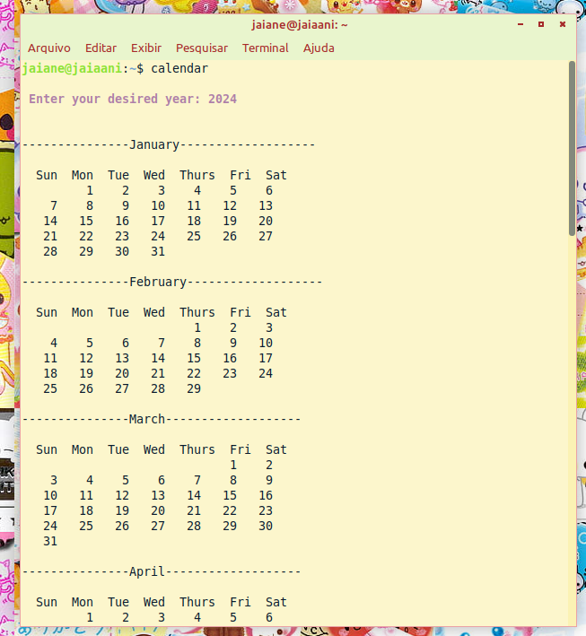

Just clone the repository and run [this script](run.sh) to see it working in your terminal.

If you want this to become a command in your terminal, you can run or follow [this script](script.sh). 

I did this as the first project to go into c, following this sweet tutorial:

https://www.youtube.com/watch?v=VRcJpUOKRt8&ab_channel=TechsaneGirl

